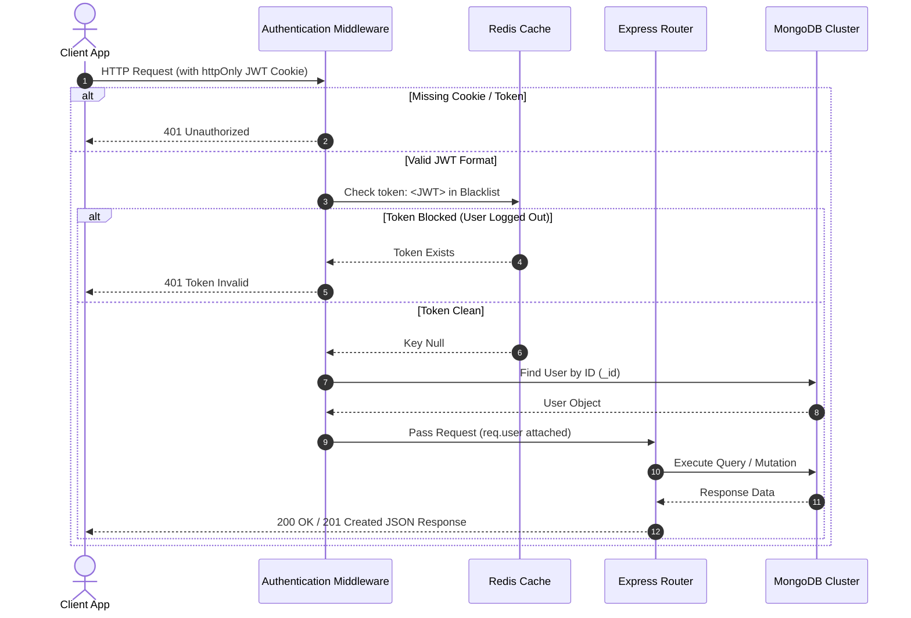
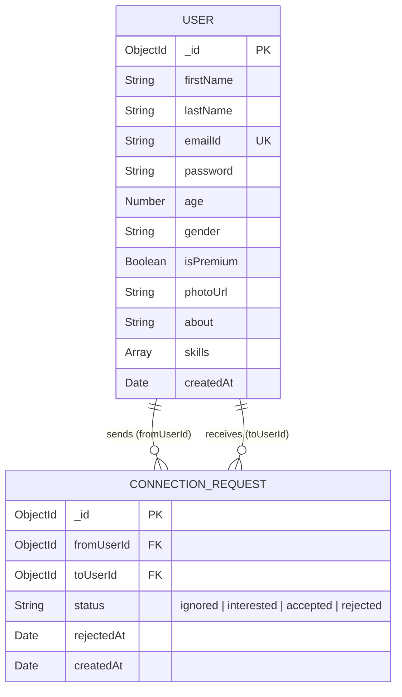

# SwipeMate — Developer Matchmaking Backend API 🚀


SwipeMate is a production-ready, high-performance backend application built with **Node.js**, **Express.js**, **MongoDB**, and **Redis**. Designed as a developer-centric networking platform (similar to Tinder for software developers), it powers peer discovery, connection requests (`interested` / `ignored`), relationship management (`accepted` / `rejected`), developer feed generation, and security-hardened authentication.

---

## 🏗️ System Architecture & Auth Flow



---

## 🌟 Key Engineering & Architectural Highlights

- **Stateful Token Invalidation with Redis**:
  - Uses **JWT** delivered via secure, `httpOnly` cookies to protect against XSS attacks.
  - Solves the classic stateless JWT logout dilemma by maintaining a **Redis Blacklist**. Upon logout, the token is saved in Redis with an dynamic TTL set to its exact remaining lifespan (`exp` timestamp), ensuring instant session revocation with zero memory leaks.

- **Developer Matchmaking & Feed Algorithm**:
  - Engineered an optimized match generation algorithm (`GET /user/feed`) leveraging MongoDB query operators (`$nin`, `$ne`, `$or`).
  - Dynamically calculates the match pool while excluding:
    - Currently connected developers (`accepted`).
    - Pending connection requests (`interested`).
    - Self-ignored developers (`ignored`).
    - Users with active **30-day rejection cooldowns**.

- **Rejection Cooldown Lifecycle**:
  - Built-in business logic enforcing a **30-day cooldown period** when a request is rejected.
  - Once 30 days elapse, the system automatically frees up the relationship status, allowing developers to re-appear in match pools.

- **Database Performance & Schema Design**:
  - **Compound Indexing**: Added a `{ fromUserId: 1, toUserId: 1 }` index on the `ConnectionRequest` collection to eliminate duplicate pairs and achieve $O(1)$ / logarithmic query execution times.
  - **Mongoose Middleware Hooks**: Utilized `pre('save')` hooks to enforce strict database-level constraints (e.g., blocking self-connection attempts).
  - **Data Projection & Sanitization**: Proactively strips sensitive credentials (`password`) using custom projection methods before serializing API responses.

- **Parallel Bootstrapping**:
  - Implemented `Promise.all([connectDB(), redisClient.connect()])` inside `app.js` to ensure data layer readiness before spinning up the HTTP server instance.

---


## 📊 Database Schema Relationship (ER Overview)




---

## 🛠️ Tech Stack & Core Libraries

| Layer                      | Technology                 | Purpose                                                     |
| -------------------------- | -------------------------- | ----------------------------------------------------------- |
| **Runtime & Framework**    | Node.js, Express.js        | Event-driven backend execution & routing                    |
| **Primary Database**       | MongoDB, Mongoose ORM      | Document storage, relational schema validation & population |
| **Caching & Invalidation** | Redis                      | High-speed key-value store for session blacklisting         |
| **Security & Auth**        | JWT, bcrypt, Cookie-Parser | Token signing, password hashing & cookie management         |
| **Data Validation**        | Validator.js               | Email, URL, and strong password checks                      |

---

## 📂 Project Structure

```
SwipeMate/
├── src/
│   ├── config/
│   │   ├── database.js          # MongoDB connection handler
│   │   └── redis.js             # Redis Cloud client setup
│   ├── middlewares/
│   │   └── checkvalidmiddleware.js # Auth middleware (JWT + Redis Blacklist check)
│   ├── models/
│   │   ├── connectionrequest.js # Relationship schema, compound index & pre-save hook
│   │   └── user.js              # User schema, bcrypt verification & JWT helper methods
│   ├── routes/
│   │   ├── auth.js              # Signup, Login, Logout (Redis Blacklisting)
│   │   ├── profile.js           # Profile retrieval & field-validated edit endpoints
│   │   ├── request.js           # Connection request flow (Send/Review/Cooldown)
│   │   └── user.js              # Connections list, received/sent requests & discovery feed
│   └── utils/
│       └── validate.js          # Payload validation & key sanitization helpers
├── src/app.js                   # Main application entry point & DB/Redis bootstrapper
├── package.json
└── README.md
```

---


## 📡 Complete API Reference


### 🔑 Auth Routes (`/auth`)

| Method | Endpoint       | Description                                                     | Auth Required |
| ------ | -------------- | --------------------------------------------------------------- | ------------- |
| `POST` | `/auth/signup` | Creates a new user profile, hashes password, returns JWT cookie | ❌            |
| `POST` | `/auth/login`  | Validates credentials, returns signed HTTP-only cookie          | ❌            |
| `POST` | `/auth/logout` | Clears cookie and pushes token to Redis blacklist with TTL      | `YES`         |

### 👤 Profile Routes (`/profile`)

| Method  | Endpoint        | Description                                                                      | Auth Required |
| ------- | --------------- | -------------------------------------------------------------------------------- | ------------- |
| `GET`   | `/profile/view` | Fetches authenticated user profile data                                          | `YES`         |
| `PATCH` | `/profile/edit` | Updates allowed profile attributes (`skills`, `photoUrl`, etc.)                  | `YES`         |


### 🤝 Connection Request Routes (`/request`)

| Method | Endpoint                             | Description                                                    | Auth Required |
| ------ | ------------------------------------ | -------------------------------------------------------------- | ------------- |
| `POST` | `/request/send/:status/:toUserId`    | Sends request (`interested` or `ignored`)                      | `YES`         |
| `POST` | `/request/review/:status/:requestId` | Handles incoming request response (`accepted` or `rejected`)   | `YES`         |


### ⚡ User & Discovery Routes (`/user`)

| Method | Endpoint                     | Description                                                                   | Auth Required |
| ------ | ---------------------------- | ----------------------------------------------------------------------------- | ------------- |
| `GET`  | `/user/requests/received`    | Lists pending incoming connection requests (`interested`)                     | `YES`         |
| `GET`  | `/user/requests/sent`        | Lists sent connection requests                                                | `YES`         |
| `GET`  | `/user/connections`          | Lists all active connected developers (`accepted`)                            | `YES`         |
| `GET`  | `/user/feed?page=1&limit=30` | Returns custom paginated discovery feed                                       | `YES`         |

---


## 🚀 Local Development Setup


### 1. Prerequisites

- **Node.js**: v18.x or higher
- **MongoDB**: Local URI or MongoDB Atlas Cluster connection string
- **Redis**: Local Redis server or Redis Cloud instance


### 2. Installation Steps


````bash
# Clone the repository
git clone https://github.com/your-username/SwipeMate-Backend.git

# Navigate to project directory

cd SwipeMate-Backend

# Install dependencies

npm install

````

### 3. Environment Configuration
Create a `.env` file in the root folder:

```env
PORT=3000
DB_CONNECTION_SECRET=mongodb+srv://<username>:<password>@cluster.mongodb.net/SwipeMate
JWT_SECRET=your_super_secret_jwt_key
````

### 4. Running the Server

```bash
# Development mode with Nodemon
npm run dev

# Production mode
npm start
```

---

## 🔒 Security Summary

1. **XSS Mitigation**: Authentication JWT stored strictly in `httpOnly`, `sameSite: None`, `secure` cookies.
2. **Brute Force & Hash Integrity**: Salting & Hashing passwords with `bcrypt` (10 rounds).
3. **Session Revocation**: Instant token invalidation upon logout using Redis TTL expiration.
4. **Data Isolation**: Query responses explicitly project safe fields (`USER_SAFE_DATA`) to prevent leakage of credentials or metadata.
